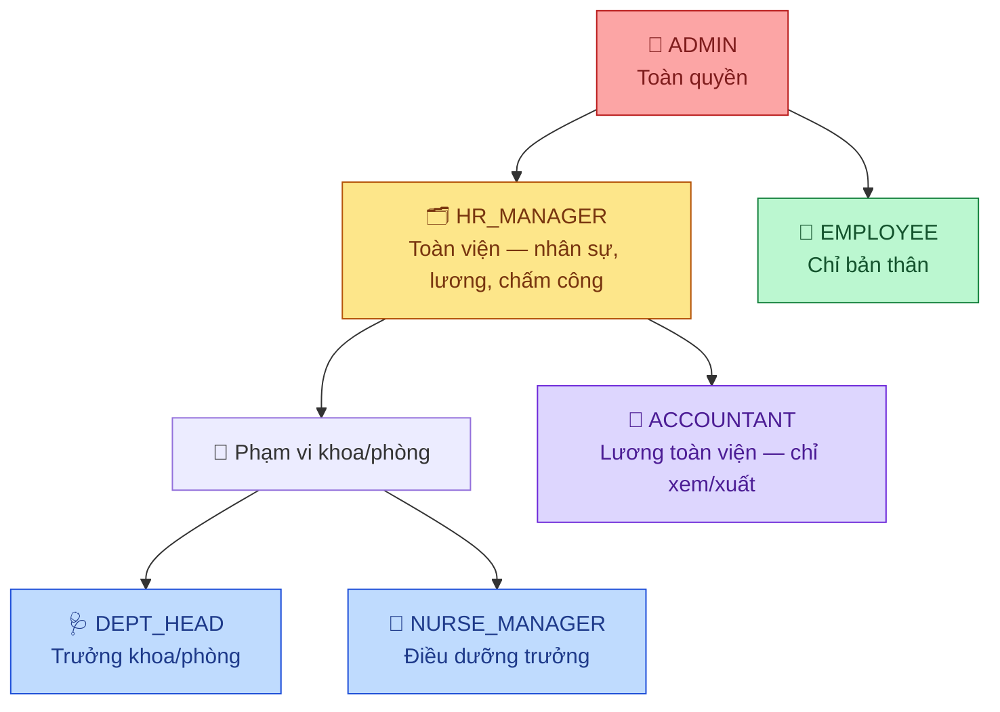
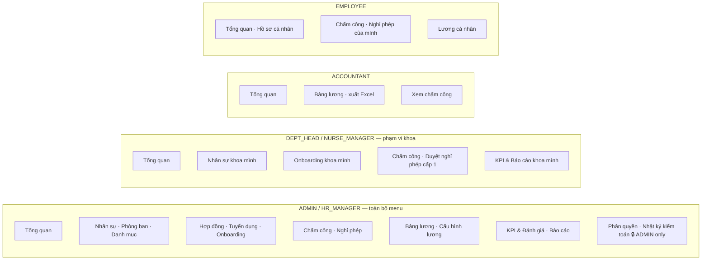
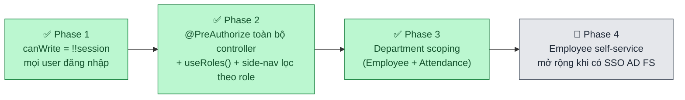

# Kế hoạch Phân quyền (RBAC) — HRM BVHN Đa khoa Nghệ An

> Định nghĩa vai trò, quyền hạn và trạng thái triển khai RBAC.
> Cập nhật: 2026-07-06 | Trạng thái: **Phase 2 & 3 đã triển khai trong code** (xem [§5](#5-lộ-trình-triển-khai))

---

## 📊 Nhìn nhanh



| Role | Mã | Phạm vi dữ liệu | Đối tượng |
|---|---|---|---|
| 👑 **Quản trị hệ thống** | `ADMIN` | Toàn viện | IT / Ban Giám đốc |
| 🗂️ **Quản lý nhân sự** | `HR_MANAGER` | Toàn viện | Phòng Tổ chức cán bộ |
| 🩺 **Trưởng khoa/phòng** | `DEPT_HEAD` | Khoa/phòng mình | Trưởng khoa, Trưởng phòng |
| 💉 **Điều dưỡng trưởng** | `NURSE_MANAGER` | Khoa mình | Điều dưỡng trưởng, Nữ hộ sinh trưởng |
| 🧾 **Kế toán** | `ACCOUNTANT` | Toàn viện (chỉ lương) | Phòng Tài chính kế toán |
| 👤 **Nhân viên** | `EMPLOYEE` | Bản thân | Toàn bộ cán bộ |

> ⚠️ **Role được suy ra từ quyền**, không gán trực tiếp (`PermissionController.deriveRole`):
> `SYSTEM_ADMIN`→`ADMIN` · `LEAVE_APPROVE_HR`→`HR_MANAGER` · `LEAVE_APPROVE_DEPT`→`DEPT_HEAD` · `LEAVE_APPROVE_NURSE`→`NURSE_MANAGER` · `PAYROLL_MANAGE`→`ACCOUNTANT` · mặc định→`EMPLOYEE`.
> `DEPARTMENT_MANAGER` là role cũ — vẫn còn trong nhiều `@PreAuthorize` (tương đương `DEPT_HEAD`/`NURSE_MANAGER`) nhưng **không còn suy ra được từ quyền** nữa, chỉ còn tác dụng nếu gán thủ công.

---

## 🔒 2. Ma trận phân quyền

<details open>
<summary><b>2.1 Module Nhân sự</b></summary>

| Chức năng | ADMIN | HR_MANAGER | DEPT_MANAGER* | EMPLOYEE | ACCOUNTANT |
|---|:---:|:---:|:---:|:---:|:---:|
| Xem danh sách toàn viện | ✅ | ✅ | ❌ | ❌ | ❌ |
| Xem danh sách trong khoa mình | ✅ | ✅ | ✅ | ❌ | ❌ |
| Xem hồ sơ cá nhân | ✅ | ✅ | ✅ | ✅** | ❌ |
| Thêm / Sửa / Cho thôi việc | ✅ | ✅ | ❌ | ❌ | ❌ |
| Xuất Excel danh sách nhân viên | ✅ | ✅ | ✅ | ❌ | ❌ |
| Xem phòng ban | ✅ | ✅ | ✅ | ✅ | ❌ |

> \* Bao gồm `DEPT_HEAD` / `NURSE_MANAGER` — chỉ khoa/phòng của chính mình, ép ở tầng Controller ([§4.1](#41-backend--spring-security))
> \*\* Chỉ hồ sơ bản thân

</details>

<details>
<summary><b>2.2 Module Chấm công & Nghỉ phép</b></summary>

| Chức năng | ADMIN | HR_MANAGER | DEPT_MANAGER* | EMPLOYEE | ACCOUNTANT |
|---|:---:|:---:|:---:|:---:|:---:|
| Xem chấm công toàn viện | ✅ | ✅ | ❌ | ❌ | ❌ |
| Xem / chấm công trong khoa | ✅ | ✅ | ✅ | ❌ | ❌ |
| Tự chấm công (check-in/out) | ✅ | ✅ | ✅ | ✅ | ✅ |
| Duyệt đơn nghỉ phép — cấp 1 (khoa) | ❌ | ❌ | ✅ | ❌ | ❌ |
| Duyệt đơn nghỉ phép — cấp 2 (TCCB) | ✅ | ✅ | ❌ | ❌ | ❌ |
| Gửi đơn / xem đơn của bản thân | ✅ | ✅ | ✅ | ✅ | ✅ |

> \* `DEPT_HEAD`/`NURSE_MANAGER` chỉ duyệt cấp 1 cho nhân viên khoa mình

</details>

<details>
<summary><b>2.3 Module Bảng lương</b></summary>

| Chức năng | ADMIN | HR_MANAGER | DEPT_MANAGER* | EMPLOYEE | ACCOUNTANT |
|---|:---:|:---:|:---:|:---:|:---:|
| Xem bảng lương toàn viện | ✅ | ✅ | ❌ | ❌ | ✅ |
| Xem lương cá nhân | ✅ | ✅ | ✅** | ✅** | ✅** |
| Tạo bảng lương tháng / Cấu hình lương | ✅ | ✅ | ❌ | ❌ | ❌ |
| Xuất Excel bảng lương | ✅ | ✅ | ❌ | ❌ | ✅ |
| Xuất phiếu lương PDF | ✅ | ✅ | ✅** | ✅** | ❌ |

> \* Phạm vi khoa/phòng mình  \*\* Chỉ của bản thân

</details>

<details>
<summary><b>2.4 Module Tuyển dụng</b></summary>

| Chức năng | ADMIN | HR_MANAGER | DEPT_MANAGER* | EMPLOYEE | ACCOUNTANT |
|---|:---:|:---:|:---:|:---:|:---:|
| Tạo/sửa vị trí tuyển dụng | ✅ | ✅ | ❌ | ❌ | ❌ |
| Xem danh sách ứng viên / pipeline | ✅ | ✅ | ✅* | ❌ | ❌ |
| Đánh giá ứng viên, lên lịch phỏng vấn | ✅ | ✅ | ❌ | ❌ | ❌ |

> \* Chỉ vị trí thuộc khoa/phòng mình

</details>

---

## 🧭 3. Điều hướng theo Role

> Khớp với `frontend/src/components/side-nav.tsx` (đã lọc theo `roles` thực, không còn `canWrite = !!session`).



**Mọi role đều thấy:** 2FA (Cài đặt & Hệ thống), Hồ sơ cá nhân, Lương cá nhân, Chấm công/Nghỉ phép của bản thân.

---

## ⚙️ 4. Triển khai kỹ thuật

<details open>
<summary><b>4.1 Backend — Spring Security</b></summary>

```java
// SecurityConfig.java
@EnableMethodSecurity

// Controller — role toàn viện
@PreAuthorize("hasAnyRole('ADMIN', 'HR_MANAGER')")
@PostMapping("/employees")
public ResponseEntity<EmployeeResponse> create(...) { }

// Department scoping — ép ở tầng Controller, KHÔNG tin departmentId frontend gửi lên
@GetMapping
@PreAuthorize("hasAnyRole('ADMIN', 'HR_MANAGER', 'DEPARTMENT_MANAGER')")
public ApiResponse<Page<EmployeeResponse>> search(..., Authentication auth) {
    boolean isDeptManager = auth.getAuthorities().stream()
        .anyMatch(a -> a.getAuthority().equals("ROLE_DEPARTMENT_MANAGER"))
        && auth.getAuthorities().stream()
            .noneMatch(a -> a.getAuthority().equals("ROLE_ADMIN") || a.getAuthority().equals("ROLE_HR_MANAGER"));
    if (isDeptManager) departmentId = departmentScopePort.getDepartmentIdByEmail(emailFrom(auth));
    return employeeService.search(keyword, status, departmentId, pageable);
}
```

✅ Đã áp dụng cho: `EmployeeController`, `AttendanceController` (xem `DepartmentScopePort`/`DepartmentScopeAdapter`).

</details>

<details>
<summary><b>4.2 Frontend — Next.js</b></summary>

```tsx
// hooks/useRoles.ts — đã triển khai đầy đủ
export function useRoles() {
  const { data: session } = useSession()
  const roles = (session?.roles ?? []) as AppRole[]
  const has = (...r: AppRole[]) => r.some(x => roles.includes(x))
  return {
    isAdmin: has('ADMIN'),
    isHR: has('ADMIN', 'HR_MANAGER'),
    isDeptManager: has('DEPARTMENT_MANAGER', 'DEPT_HEAD', 'NURSE_MANAGER'),
    canWriteHR: has('ADMIN', 'HR_MANAGER'),
    canViewPayroll: has('ADMIN', 'HR_MANAGER', 'ACCOUNTANT'),
    canApproveLeave: has('ADMIN', 'HR_MANAGER', 'DEPARTMENT_MANAGER', 'DEPT_HEAD', 'NURSE_MANAGER'),
    // ...
  }
}

// side-nav.tsx — mỗi NavItem khai báo roles?: AppRole[], lọc bằng canSee()
const canSee = (required?: AppRole[]) =>
  !required || required.length === 0 || required.some(r => roles.includes(r))
```

</details>

<details>
<summary><b>4.3 Tài khoản test</b></summary>

| Tài khoản | Role | Mục đích |
|---|---|---|
| `admin.hrm` | `ADMIN` | Quản trị hệ thống |
| `hr.manager` | `HR_MANAGER` | Phòng Tổ chức cán bộ |
| `dept.head.{code}` | `DEPT_HEAD` | Trưởng các khoa/phòng |
| `nurse.manager.{code}` | `NURSE_MANAGER` | Điều dưỡng trưởng khoa |
| `accountant.hrm` | `ACCOUNTANT` | Phòng Tài chính |
| `{ma_can_bo}` | `EMPLOYEE` | Toàn bộ cán bộ |

</details>

---

## 5. Lộ trình triển khai



> Trạng thái Phase 2 & 3 xác nhận qua code hiện tại (không còn là kế hoạch): `@PreAuthorize` đã có ở hầu hết controller, `DepartmentScopePort` đã tích hợp ở `EmployeeController` + `AttendanceController`, `side-nav.tsx` đã lọc menu theo `roles` thực. Tài liệu này trước đây (2026-06-24) mô tả các mục này là "chưa làm" — đã cập nhật lại theo trạng thái thật.

### Còn thiếu / cần làm tiếp

- [ ] Department scoping cho module **Tuyển dụng** (hiện DEPT_MANAGER xem được toàn bộ candidate, chưa lọc theo khoa)
- [ ] Test matrix: mỗi role → thử truy cập tất cả endpoint (xem [`TEST_STRATEGY.md`](./TEST_STRATEGY.md) §7 Bảo mật — SEC-06)
- [ ] Thống nhất `DEPARTMENT_MANAGER` (role cũ) → chuyển hẳn sang `DEPT_HEAD`/`NURSE_MANAGER` hoặc xóa khỏi các `@PreAuthorize` nếu không còn tài khoản nào mang role này
