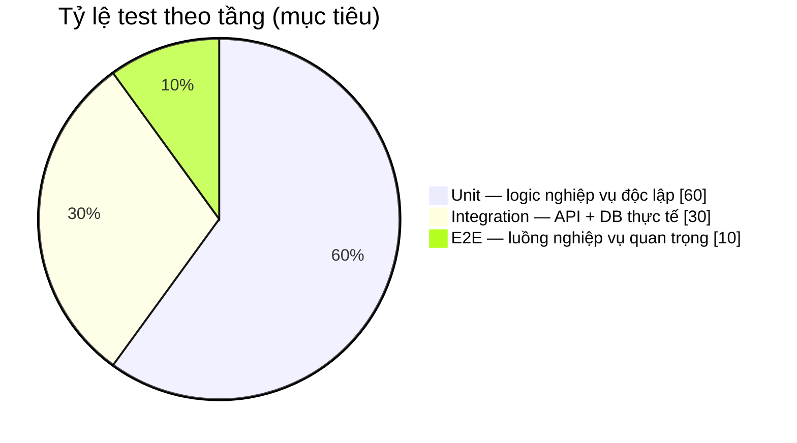
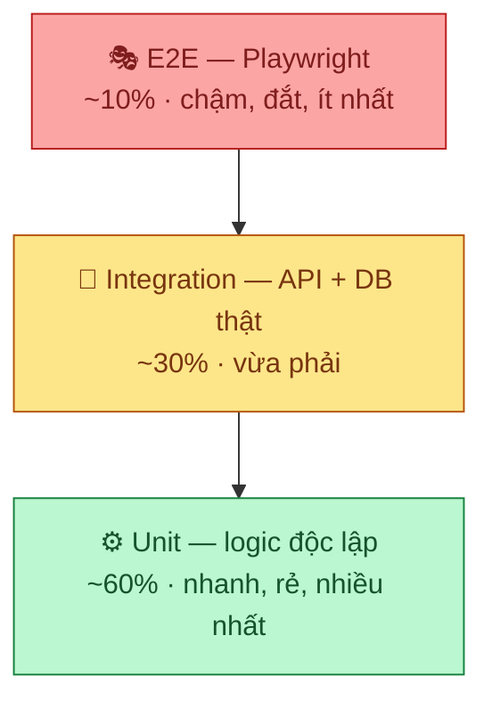
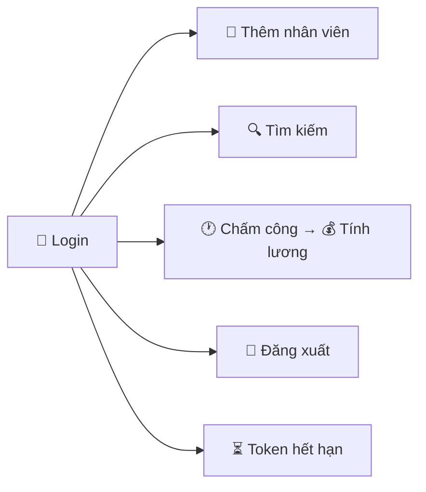
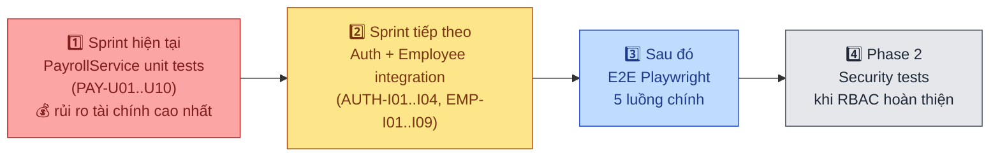

# HRM Testing Strategy — BVHN Đa khoa Nghệ An

> Tài liệu này định nghĩa chiến lược kiểm thử toàn hệ thống HRM.
> Cập nhật lần cuối: 2026-07-06

---

## 📊 Nhìn nhanh (Dashboard)

| Module | Rủi ro | Ưu tiên | Unit | Integration | Frontend | E2E | Coverage hiện tại |
|---|:---:|:---:|:---:|:---:|:---:|:---:|---|
| 🔐 Auth / Phân quyền | 🔴 Cao | **P0** | 4 case | 4 case | — | 1 case | `░░░░░░░░░░` 0% |
| 👤 Nhân sự — CRUD | 🔴 Cao | **P0** | 9 case | 9 case | 7 case | 2 case | `░░░░░░░░░░` 0% |
| 💰 Bảng lương | 🔴 Cao | **P0** | 10 case | 5 case | — | 1 case | `░░░░░░░░░░` 0% |
| 🕐 Chấm công / Nghỉ phép | 🟡 T.bình | P1 | 11 case | — | — | 1 case | `░░░░░░░░░░` 0% |
| 🏢 Phòng ban / Danh mục | 🟢 Thấp | P2 | — | 4 case | — | — | `░░░░░░░░░░` 0% |
| 🛡️ Bảo mật | 🔴 Cao | P1 | — | 6 case | — | — | `░░░░░░░░░░` 0% |

> Toàn bộ test case bên dưới **chưa được viết** — bảng trên phản ánh kế hoạch, không phải trạng thái đã hoàn thành. Xem [§8 Coverage Targets](#8-coverage-targets) để biết mục tiêu cụ thể.

### Kim tự tháp kiểm thử





---

## 🔐 1. Module Auth (P0)

<details>
<summary><b>1.1 Unit Tests</b> — <code>auth.ts</code> (NextAuth credentials callback) — 4 case</summary>

> Hệ thống dùng JWT tự quản lý (`POST /api/auth/login` email+password → JwtService ký token), không có IdP ngoài hay refresh-token flow.

| ID | Test case | Input | Expected |
|---|---|---|---|
| AUTH-U01 | Parse role từ response login | Backend trả `role: "ADMIN"` | `session.roles = ["ADMIN"]` |
| AUTH-U02 | Fallback khi login thất bại | Backend trả lỗi (sai mật khẩu) | `session = null`, hiện lỗi ở form |
| AUTH-U03 | Token còn hạn | JWT chưa hết hạn | `apiFetch` dùng token hiện tại |
| AUTH-U04 | Token hết hạn | JWT hết hạn (mặc định theo `JwtService`) | API trả 401, frontend tự `signOut` + redirect `/login` |

</details>

<details>
<summary><b>1.2 Integration Tests</b> — Login flow (JWT nội bộ) — 4 case</summary>

| ID | Test case | Steps | Expected |
|---|---|---|---|
| AUTH-I01 | Đăng nhập thành công | GET `/login` → submit email/password → `POST /api/auth/login` | Session có `accessToken`, `roles` |
| AUTH-I02 | Truy cập trang bảo vệ khi chưa đăng nhập | GET `/dashboard` không có session | Redirect `/login` |
| AUTH-I03 | Sai mật khẩu | Submit sai password | Hiện lỗi "Mật khẩu không đúng", không tạo session |
| AUTH-I04 | Đăng xuất | Click "Đăng xuất" (`signOut`) | Session bị xóa, redirect `/login` |

</details>

---

## 👤 2. Module Nhân sự (P0)

<details open>
<summary><b>2.1 Unit Tests</b> — <code>EmployeeService.java</code> — 9 case</summary>

| ID | Test case | Input | Expected |
|---|---|---|---|
| EMP-U01 | Tạo nhân viên hợp lệ | EmployeeRequest đầy đủ | Employee được persist, trả EmployeeResponse |
| EMP-U02 | Tạo nhân viên trùng mã | `employeeCode` đã tồn tại | Throw `DataIntegrityViolationException` |
| EMP-U03 | Tạo nhân viên trùng email | `email` đã tồn tại | Throw exception với message rõ ràng |
| EMP-U04 | Cập nhật nhân viên không tồn tại | UUID ngẫu nhiên | Throw `ResourceNotFoundException` |
| EMP-U05 | Soft delete — set TERMINATED | Employee ACTIVE | `status = TERMINATED`, data vẫn trong DB |
| EMP-U06 | Search theo keyword | keyword = "Nguyễn" | Trả danh sách có fullName chứa "Nguyễn" |
| EMP-U07 | Search theo phòng ban | departmentId hợp lệ | Chỉ trả nhân viên của phòng đó |
| EMP-U08 | Phân trang | page=0, size=20 | Trả đúng 20 record, totalPages chính xác |
| EMP-U09 | Filter status TERMINATED | status=TERMINATED | Chỉ trả nhân viên đã nghỉ |

</details>

<details>
<summary><b>2.2 Integration Tests</b> — REST API <code>/api/personnel/employees</code> — 9 case</summary>

| ID | Test case | Request | Expected |
|---|---|---|---|
| EMP-I01 | POST tạo mới — hợp lệ | Body đầy đủ, token ADMIN | 200, trả Employee JSON |
| EMP-I02 | POST thiếu trường bắt buộc | Không có `fullName` | 400, message validation rõ ràng |
| EMP-I03 | POST không có token | Không có Authorization header | 401 |
| EMP-I04 | GET danh sách | Token hợp lệ | 200, Page<Employee> |
| EMP-I05 | GET theo ID tồn tại | ID hợp lệ | 200, Employee |
| EMP-I06 | GET theo ID không tồn tại | UUID ngẫu nhiên | 404 |
| EMP-I07 | PUT cập nhật | Body hợp lệ | 200, Employee đã cập nhật |
| EMP-I08 | DELETE (soft) | ID nhân viên ACTIVE | 200, status=TERMINATED |
| EMP-I09 | Tìm kiếm full-text | `keyword=Nguyen` | 200, kết quả phù hợp |

</details>

<details>
<summary><b>2.3 Frontend Component Tests</b> — 7 case</summary>

| ID | Test case | Expected |
|---|---|---|
| EMP-F01 | Bảng nhân viên hiển thị dữ liệu | Render đúng 20 rows |
| EMP-F02 | Nút "+ Thêm" mở modal | Modal `EmployeeFormModal` xuất hiện |
| EMP-F03 | Form validate trống | Hiển thị lỗi "Bắt buộc" |
| EMP-F04 | Submit form hợp lệ | Gọi `createEmployee`, đóng modal, refresh list |
| EMP-F05 | Pagination — bấm "Sau →" | Page tăng 1, gọi API với `page+1` |
| EMP-F06 | Filter theo phòng ban | Dropdown chọn phòng → gọi API với `departmentId` |
| EMP-F07 | Nút "Nghỉ việc" hiện confirm | Confirm dialog xuất hiện trước khi gọi API |

</details>

---

## 🕐 3. Module Chấm công & Nghỉ phép (P1)

<details>
<summary><b>3.1 Unit Tests</b> — <code>AttendanceService.java</code> — 6 case</summary>

| ID | Test case | Input | Expected |
|---|---|---|---|
| ATT-U01 | Check-in lần đầu trong ngày | Employee chưa có record hôm nay | Tạo record, `checkIn = now` |
| ATT-U02 | Check-in khi đã check-in rồi | Employee đã có record `checkIn != null` | Throw exception "Đã check-in" |
| ATT-U03 | Check-out hợp lệ | Đã check-in, chưa check-out | Cập nhật `checkOut`, tính `workingMinutes` |
| ATT-U04 | Check-out khi chưa check-in | Không có record hôm nay | Throw exception |
| ATT-U05 | Tính workingMinutes chính xác | checkIn=08:00, checkOut=17:00 | `workingMinutes = 540` |
| ATT-U06 | Lấy lịch sử theo tháng | employeeId, month=2026-06 | Trả đúng records của tháng |

</details>

<details>
<summary><b>3.2 Unit Tests</b> — <code>LeaveService.java</code> — 5 case</summary>

| ID | Test case | Input | Expected |
|---|---|---|---|
| LEA-U01 | Tạo đơn nghỉ phép hợp lệ | Dates hợp lệ, lý do có | LeaveRequest status=PENDING |
| LEA-U02 | Ngày kết thúc trước ngày bắt đầu | endDate < startDate | Throw validation exception |
| LEA-U03 | Duyệt đơn nghỉ | PENDING → APPROVED | status=APPROVED |
| LEA-U04 | Từ chối đơn nghỉ | PENDING → REJECTED | status=REJECTED, lý do lưu lại |
| LEA-U05 | Duyệt đơn không phải PENDING | status=APPROVED | Throw exception |

</details>

---

## 💰 4. Module Bảng lương (P0 — quan trọng nhất)

<details open>
<summary><b>4.1 Unit Tests</b> — <code>PayrollService.java</code> — 10 case ⭐</summary>

| ID | Test case | Input | Expected |
|---|---|---|---|
| PAY-U01 | Lương cơ bản đúng hệ số | baseSalary=3.500.000, coefficient=1.5 | `grossSalary = 5.250.000` |
| PAY-U02 | Trừ ngày nghỉ không phép | workingDays=20, actualDays=18 | Trừ đúng 2/20 lương |
| PAY-U03 | Tính BHXH (8%) | grossSalary=5.000.000 | `bhxh = 400.000` |
| PAY-U04 | Tính BHYT (1.5%) | grossSalary=5.000.000 | `bhyt = 75.000` |
| PAY-U05 | Tính BHTN (1%) | grossSalary=5.000.000 | `bhtn = 50.000` |
| PAY-U06 | Tính thuế TNCN bậc 1 (≤5tr) | taxableIncome=4.000.000 | `tax = 0` (dưới ngưỡng) |
| PAY-U07 | Tính thuế TNCN bậc 2 | taxableIncome=8.000.000 | `tax = 8.000.000 * 5%` |
| PAY-U08 | Net salary = Gross - Bảo hiểm - Thuế | Đầu vào trên | Kiểm tra công thức tổng |
| PAY-U09 | Tạo payroll khi đã tồn tại tháng đó | Tháng/nhân viên đã có record | Throw "Đã tồn tại bảng lương" |
| PAY-U10 | Generate batch cho cả phòng | departmentId, month | Tạo record cho tất cả nhân viên ACTIVE |

</details>

<details>
<summary><b>4.2 Integration Tests</b> — REST API <code>/api/payroll</code> — 5 case</summary>

| ID | Test case | Request | Expected |
|---|---|---|---|
| PAY-I01 | POST generate lương tháng | month=2026-06, employeeIds | 200, PayrollRecord[] |
| PAY-I02 | GET bảng lương theo tháng | month=2026-06 | 200, Page<PayrollRecord> |
| PAY-I03 | GET export Excel | month=2026-06 | 200, Content-Type: application/vnd.openxmlformats |
| PAY-I04 | Lương tháng chưa có dữ liệu chấm công | month=2099-01 | 200 nhưng workingDays=0 hoặc báo warning |
| PAY-I05 | Truy cập không có quyền | Token role=VIEWER | 403 |

</details>

---

## 🏢 5. Module Phòng ban / Danh mục (P2)

<details>
<summary><b>5.1 Integration Tests</b> — 4 case</summary>

| ID | Test case | Expected |
|---|---|---|
| DEPT-I01 | GET /departments trả danh sách phẳng | Không có GRP- trong response nếu filter |
| DEPT-I02 | GET /departments/tree trả cấu trúc cây | Mỗi node có `children[]` đúng |
| DEPT-I03 | GRP nodes có children | GRP-KHOA chứa các K- departments |
| DEPT-I04 | DV-001/002/003 đúng parent | DV-001.parentId = GRP-TRUNGTAM |

</details>

---

## 🎭 6. E2E Tests — Playwright (P1)



| ID | Scenario | Steps | Expected |
|---|---|---|---|
| E2E-01 | Thêm nhân viên mới end-to-end | Login → Nhân sự → + Thêm → Điền form → Submit | Nhân viên xuất hiện trong bảng |
| E2E-02 | Tìm kiếm nhân viên | Nhập tên vào ô tìm → Bấm Tìm | Kết quả lọc đúng |
| E2E-03 | Chấm công → Tính lương | Check-in/out → Generate payroll tháng | Lương phản ánh ngày công đúng |
| E2E-04 | Đăng xuất | Bấm Đăng xuất | Redirect `/login`, session xóa |
| E2E-05 | Token hết hạn mid-session | Giả lập token expire | 401 → tự `signOut` + redirect `/login` (không auto-refresh) |

---

## 🛡️ 7. Bảo mật (Security Tests) — P1

| ID | Test case | Input | Expected |
|---|---|---|---|
| SEC-01 | API không có token | — | 401 mọi endpoint trừ `/actuator/health` |
| SEC-02 | Token giả mạo | — | 401 |
| SEC-03 | CORS — origin không hợp lệ | — | Blocked |
| SEC-04 | SQL injection trong search | `'; DROP TABLE--` | 400 hoặc empty result, không lỗi DB |
| SEC-05 | XSS trong fullName | `<script>alert(1)</script>` | Escaped khi hiển thị trên UI |
| SEC-06 | Truy cập dữ liệu nhân viên khác phòng | DEPARTMENT_MANAGER phòng A đọc phòng B | 403 |

---

## 8. Coverage Targets

| Layer | Target | Hiện tại | |
|---|---|---|---|
| Backend Unit (JUnit) | ≥ 70% line coverage | 0% | `░░░░░░░░░░` |
| Backend Integration | P0 endpoints 100% | 0% | `░░░░░░░░░░` |
| Frontend Component | P0 components ≥ 60% | 0% | `░░░░░░░░░░` |
| E2E | 5 luồng chính | 0% | `░░░░░░░░░░` |

---

## 9. Công cụ & Setup

<details>
<summary><b>Backend</b> — JUnit + H2</summary>

```xml
<!-- pom.xml -->
<dependency>
  <groupId>org.springframework.boot</groupId>
  <artifactId>spring-boot-starter-test</artifactId>
  <scope>test</scope>
</dependency>
<!-- H2 in-memory cho unit tests -->
<dependency>
  <groupId>com.h2database</groupId>
  <artifactId>h2</artifactId>
  <scope>test</scope>
</dependency>
```

</details>

<details>
<summary><b>Frontend</b> — Vitest + Testing Library + Playwright</summary>

```bash
npm install -D @testing-library/react @testing-library/jest-dom vitest
npm install -D @playwright/test  # E2E
```

</details>

<details>
<summary><b>Chạy tests</b></summary>

```bash
# Backend unit + integration
cd backend && mvn test

# Frontend component
cd frontend && npm test

# E2E
cd frontend && npx playwright test
```

</details>

---

## 10. Lộ trình triển khai


