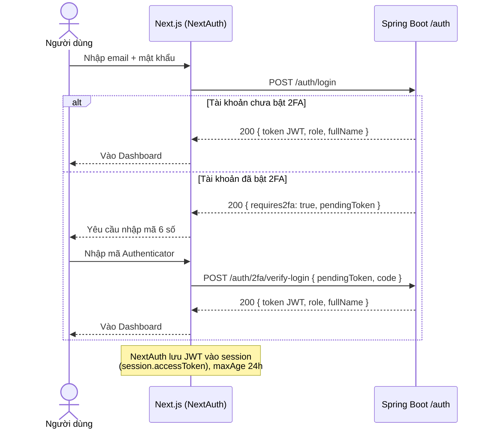
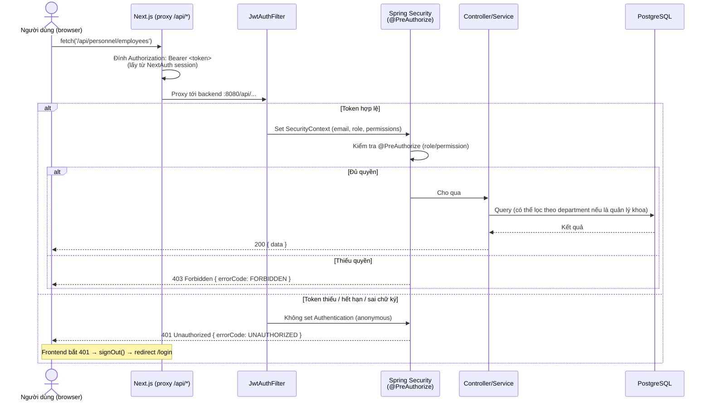
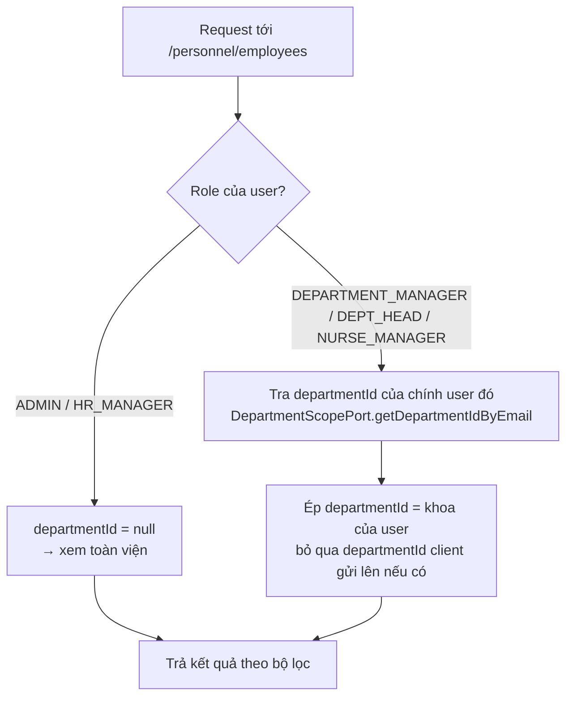
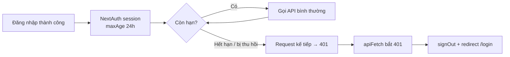

# Luồng truy cập hệ thống — HRM BVHN Đa khoa Nghệ An

> Tài liệu này mô tả **luồng** người dùng đi qua hệ thống — từ đăng nhập đến khi gọi một API cụ thể — bằng sơ đồ trực quan (Mermaid).
> Ma trận quyền chi tiết theo module: xem [`RBAC_PLAN.md`](./RBAC_PLAN.md). Tài liệu này không lặp lại bảng quyền, chỉ mô tả **cách hệ thống xử lý** một request.

---

## 1. Đăng nhập (có/không 2FA)

**Ghi chú:**
- `pendingToken` (bước 2FA) chỉ sống **5 phút** và không mang quyền — không gọi được API nghiệp vụ, chỉ dùng để xác minh mã TOTP.
- JWT thật (sau khi đăng nhập thành công) có hạn **24h** (`app.jwt.expiration-ms`), chứa `role`, `permissions`, `employeeId`.

---

## 2. Gọi API sau khi đăng nhập

**Ghi chú:** hai nhánh lỗi (401 vs 403) được tách rõ từ bản vá gần nhất (`SecurityConfig` — `AuthenticationEntryPoint` / `AccessDeniedHandler`):
- **401** = chưa đăng nhập / token hết hạn → tự động đăng xuất + về trang login.
- **403** = đã đăng nhập nhưng role không đủ quyền → hiển thị lỗi tại chỗ, không đăng xuất.

---

## 3. Thu hẹp phạm vi theo khoa/phòng (Department Scoping)

Áp dụng cho `DEPARTMENT_MANAGER` / `DEPT_HEAD` / `NURSE_MANAGER` — không phải role toàn viện.

Cơ chế này chạy **ở tầng Controller**, không tin tưởng `departmentId` do frontend gửi lên — kể cả khi frontend bị sửa/bypass, quản lý khoa vẫn chỉ nhận dữ liệu khoa mình (chống leo thang quyền qua tham số request).

---

## 4. Vòng đời phiên đăng nhập

---

## 5. Điều hướng menu theo role (tóm tắt)

Chi tiết đầy đủ từng chức năng: xem mục *"3. Navigation theo Role"* trong [`RBAC_PLAN.md`](./RBAC_PLAN.md). Tóm tắt nhanh:

| Role | Phạm vi dữ liệu | Ví dụ module thấy trên menu |
|---|---|---|
| `ADMIN` | Toàn viện | Tất cả |
| `HR_MANAGER` | Toàn viện | Nhân sự, Chấm công, Lương, Tuyển dụng, Cấu hình |
| `DEPARTMENT_MANAGER` / `DEPT_HEAD` / `NURSE_MANAGER` | Khoa/phòng mình | Nhân sự (khoa), Chấm công (khoa), Duyệt nghỉ phép cấp 1, Tuyển dụng (khoa) |
| `ACCOUNTANT` | Toàn viện (chỉ lương) | Bảng lương (xem + xuất Excel), Chấm công (xem) |
| `EMPLOYEE` | Bản thân | Chấm công cá nhân, Nghỉ phép, Lương cá nhân |

---

## 6. Tham chiếu code

| Thành phần | File |
|---|---|
| Cấu hình bảo mật, entry point 401/403 | `backend/app/src/main/java/vn/hrm/app/config/SecurityConfig.java` |
| Lọc & xác thực JWT trên mỗi request | `backend/app/src/main/java/vn/hrm/app/auth/JwtAuthFilter.java` |
| Đăng nhập, 2FA | `backend/app/src/main/java/vn/hrm/app/auth/AuthController.java` |
| NextAuth (session, JWT trên frontend) | `frontend/src/lib/auth.ts` |
| Gọi API + xử lý 401 | `frontend/src/lib/api.ts` |
| Hook kiểm tra role trên UI | `frontend/src/hooks/useRoles.ts` |
| Thu hẹp theo khoa (ví dụ) | `backend/module-personnel/src/main/java/vn/hrm/personnel/controller/EmployeeController.java` |
